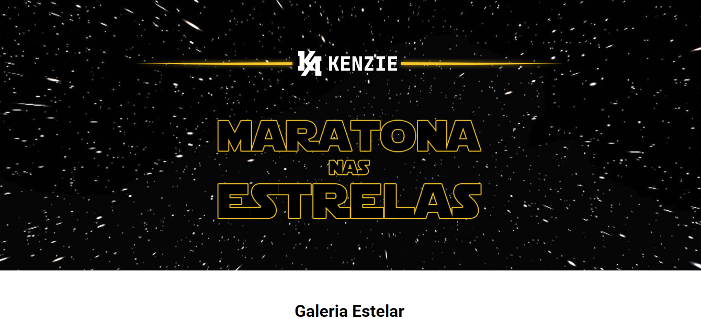
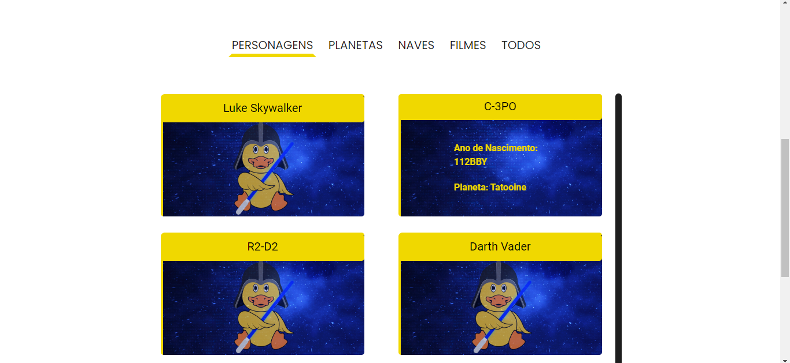
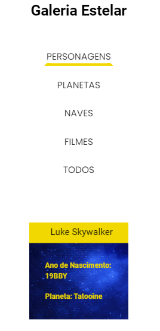

# Star Wars API

Este projeto é uma aplicação front-end que consome a [API SWAPI de Star Wars](https://swapi.dev/documentation). A aplicação exibe informações sobre personagens, filmes, planetas e naves espaciais da franquia Star Wars. A interface do usuário é construída com HTML, CSS e JavaScript. A aplicação foi desenvolvida com o objetivo de consolidar os conhecimentos adquiridos durante a Maratona nas Estrelas, evento promovido pela [Kenzie Academy](https://kenzie.com.br/).

## Tecnologias
- HTML
- CSS
- JavaScript
- [SWAPI](https://swapi.dev/documentation)

## Layout Figma

- [Layout da aplicação](https://www.figma.com/file/8czyicdQ7j0kCJXc3G06lj/Evento-Star-Wars?type=design&node-id=34-92&t=nKQPR7dFp7o6m6b2-0)

## Imagens do projeto

### Home

### Page Personagens
Repare que o card de cada personagem pode ser clicado, e ao clicar, o card faz um flip e exibe mais informações sobre o personagem.

### Responsividade
